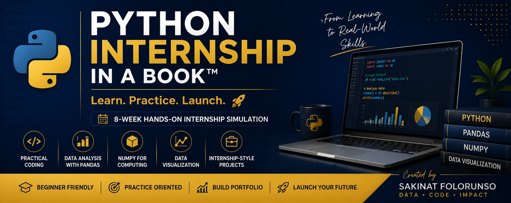

### Python InternshipInABook™
## Learn. Practice. Launch.

An 8-week hands-on internship simulation designed to help learners build practical Python programming skills through guided notebooks, datasets, and real-world exercises.


## What You Will Learn

This internship-style experience covers:

- Python fundamentals
- Lists and loops
- Functions and file handling
- Error handling and modules
- NumPy
- Pandas for data analysis
- Data visualization
- Practical debugging and coding workflows


## Repository Structure

```text
datasets/
notebooks/
README.md


## Starter Notebooks

| Week | Topic |
|---|---|
| 01 | Python Basics |
| 02 | Lists and Loops |
| 03 | Functions and Files |
| 04 | Errors and Modules |
| 05 | NumPy |
| 06 | Pandas Introduction |
| 07 | Pandas Analysis |
| 08 | Visualization |


## Datasets Included

This repository includes beginner-friendly datasets for:

- restaurant analytics,
- order analysis,
- menu exploration,
- and data cleaning exercises.


## Recommended Tools

Learners can use:

- Jupyter Notebook
- Google Colab
- VS Code
- Anaconda


## Who This Is For

- beginners in Python,
- university students,
- aspiring data analysts,
- AI/ML newcomers,
- internship preparation learners,
- and self-paced tech learners.


## Getting Started

1. Clone or download this repository.
2. Open the notebooks folder.
3. Start from Week 01.
4. Practice consistently.
5. Build your portfolio.


## Author

Sakinat Folorunso

## License

This repository is provided for educational purposes only.

Commercial redistribution of the materials without permission is prohibited.


# Learn. Practice. Launch.
